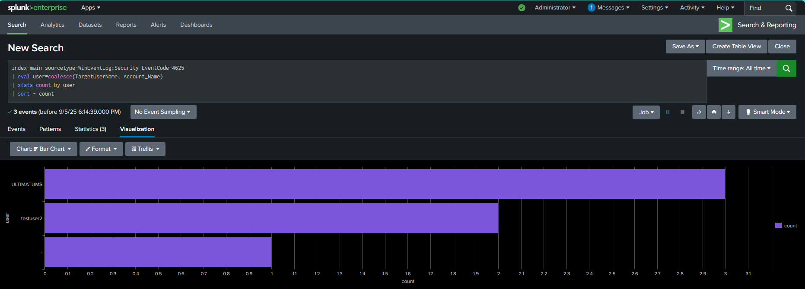
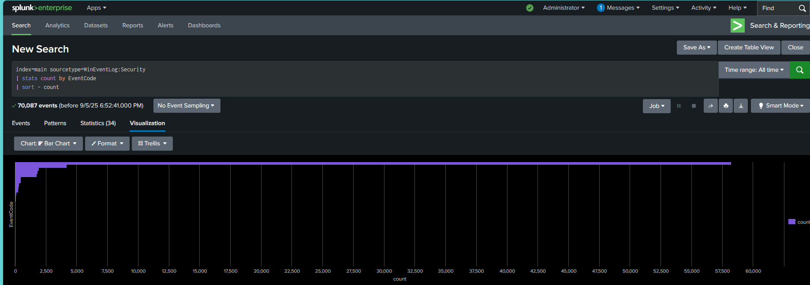
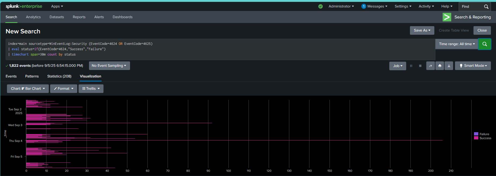
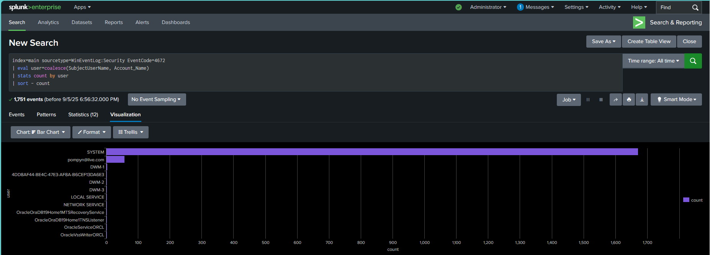

# Splunk Security Log Analysis Project

## 📌 Overview
This project demonstrates how Windows Event Logs can be ingested into **Splunk** and analyzed to identify key security events such as failed logons, privileged account usage, and general authentication trends.  
The goal is to showcase security monitoring skills and the ability to create meaningful dashboards from raw log data.

---

## ⚙️ Environment Setup
- **OS**: Windows 11 (log source)
- **Splunk Version**: Splunk Enterprise (local instance)
- **Data Source**: Windows Security Event Logs (`.evtx`)
- **Users Created**:  
  - Test accounts (`testuser1`, `testuser2`, etc.)  
  - Admin account with elevated privileges for comparison  

---

## 📊 Visualizations

### 1. Failed Logons by User
This chart highlights which users had the most failed logon attempts, helping detect potential brute force or misconfigured accounts.  

**SPL Query:**

index=main sourcetype=WinEventLog:Security EventCode=4625
| stats count by Account_Name
| sort -count
---

### 2. Event Distribution by Code
Shows the count of events grouped by Event ID, making it easier to see which types of events dominate the logs.  

**SPL Query:**

index=main sourcetype=WinEventLog:Security
| stats count by EventCode
| sort -count

---

### 3. Logon Activity Over Time
Displays successful logons across users to identify patterns of normal vs. abnormal activity.  

**SPL Query:**

index=main sourcetype=WinEventLog:Security EventCode=4624
| timechart span=1h count by Account_Name
---

### 4. Privileged Logons
Highlights logons performed with elevated privileges (e.g., local administrator). This is crucial for spotting risky activity.  

**SPL Query:**

index=main sourcetype=WinEventLog:Security EventCode=4624
| search Logon_Type=2 OR Logon_Type=10
| eval Privileged=if(Account_Name="Administrator" OR Account_Name="SYSTEM", "Privileged", "Standard")
| stats count by Privileged, Account_Name
---

## 🔍 Key Takeaways
- Demonstrated **log ingestion** and **data parsing** from Windows Security Logs.
- Built queries to analyze **failed logons, event distribution, and privileged activity**.
- Created **visual dashboards** that can be used by a SOC or IT team for monitoring.
- Reinforced understanding of **Splunk Search Processing Language (SPL)**.

---

## 🚀 Next Steps
- Add detection for **account lockouts** (EventCode=4740).  
- Correlate failed logons with **source IP addresses**.  
- Build a real-time alert for excessive failed logons.  
- Expand dataset with logs from Linux or network devices.  

---

## ✨ Skills Demonstrated
- Security log analysis
- Splunk SPL queries
- Data visualization
- Incident detection use cases
- Hands-on SIEM project workflow

